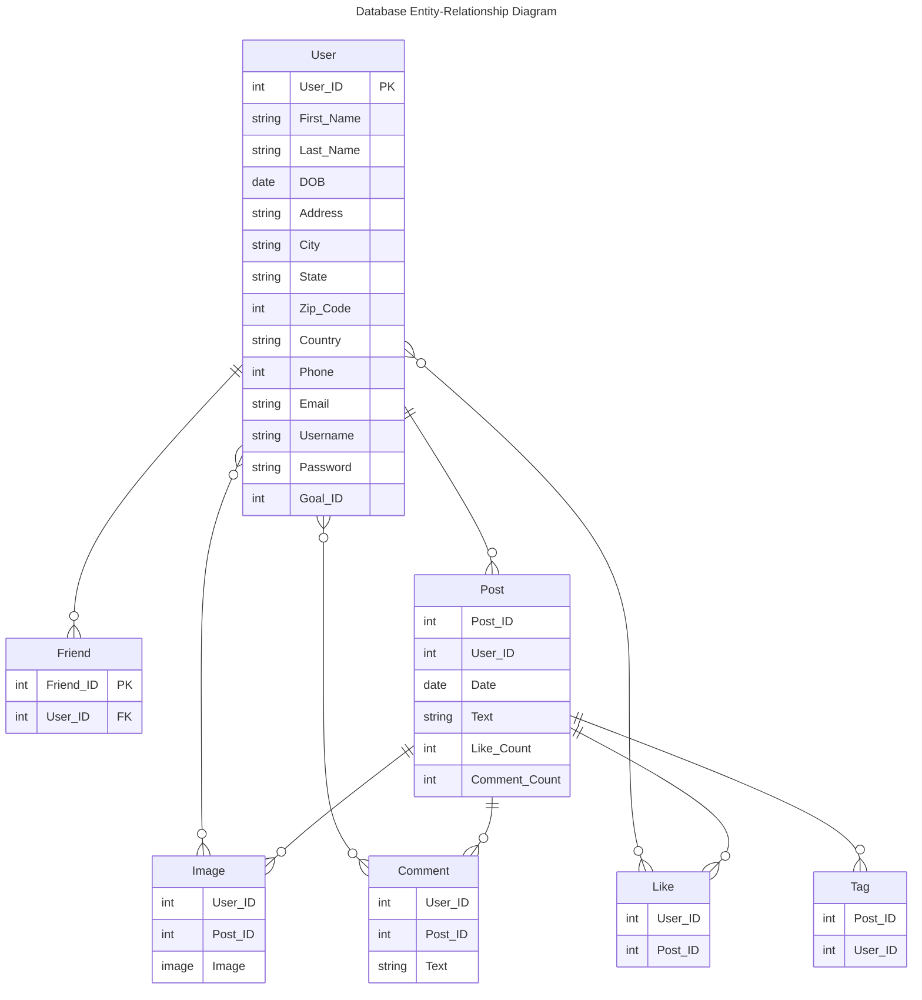

# FitConnect Database Diagram

```mermaid
---
title : Database Entity-Relationship Diagram
---
erDiagram
    User ||--o{ Friend : " "
    User ||--o{ Post : " "
    User }o--o{ Image : " "
    User }o--o{ Comment : " "
    User }o--o{ Like : " "
    User {
        int User_ID PK
        string First_Name
        string Last_Name
        date DOB
        string Address
        string City
        string State
        int Zip_Code
        string Country
        int Phone
        string Email
        string Username
        string Password
        int Goal_ID
    }
    Friend {
        int Friend_ID PK
        int User_ID FK
    }
    Post ||--o{ Image : " "
    Post ||--o{ Comment : " "
    Post ||--o{ Like : " "
    Post ||--o{ Tag : " "
    Post 
    {
        int Post_ID
        int User_ID
        date Date
        string Text
        int Like_Count
        int Comment_Count
    }
    Image 
    {
        int User_ID
        int Post_ID
        image Image
    }
    Comment 
    {
        int User_ID
        int Post_ID
        string Text
    }
    Like 
    {
        int User_ID
        int Post_ID
    }
    Tag 
    {
        int Post_ID
        int User_ID
    }
```
